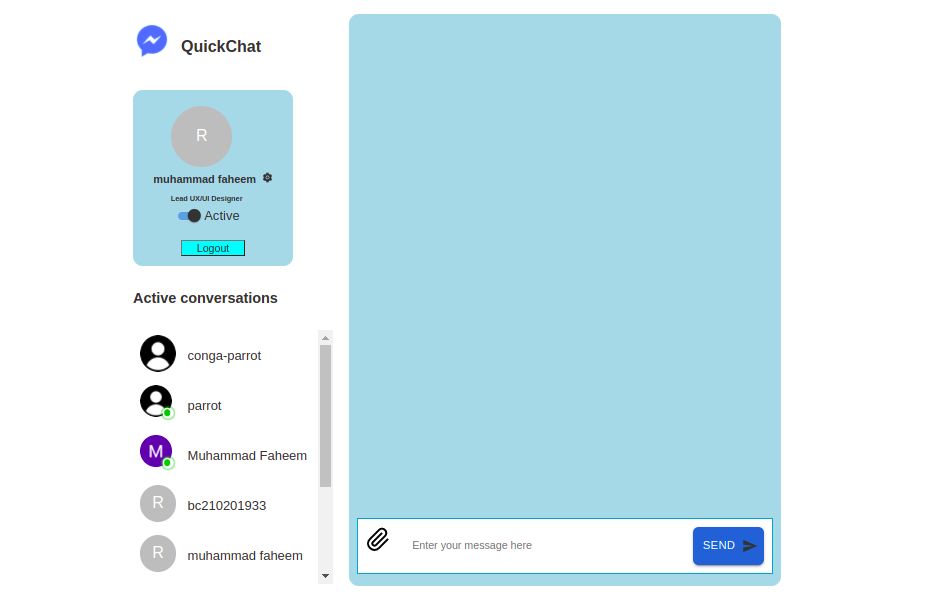

# Quick Chat

A Real Time Chat app Built using React, React-Context, React-Hooks, Firebase and Material-UI. A user can login and sign-up through google using firebase built-in UI. When multiple users logged in then their online status will be updated and displayed in real-time accordingly.

<ul>
  <li>Latest React with Function Components and React Hooks</li>
  <li>State Management With Context API</li>
  <li>Firebase Authentication</li>
  <li>Material UI</li>
</ul>

### Demo [Quick Chat](https://silly-joliot-1301d8.netlify.app/).

  
   
  
   
   
   
   
   

